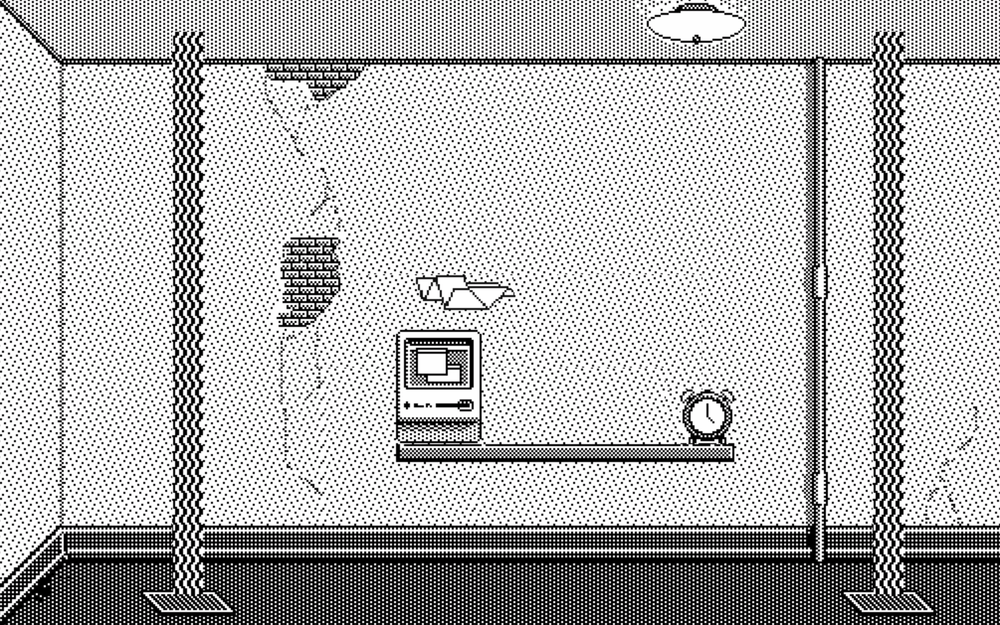

# Airtable Game Runner

A JS project that can run a generic game written in Airtable.  Handles user input and drawing.  But all game business logic is implemented in the Airtable base.

Currently uses the API, but could be converted to a block for a much better framerate.

## Setup

* `npm install`

* Create a file at `src/config.js` and put the contents of `src/config-example.js` into it.

* Add your Airtable API key in the appropriate place in `src/config.js`

* Use a static server (e.g. live-server) to serve the project directory root.

* Visit the URL of your running server in a browser.

## Glider example game

